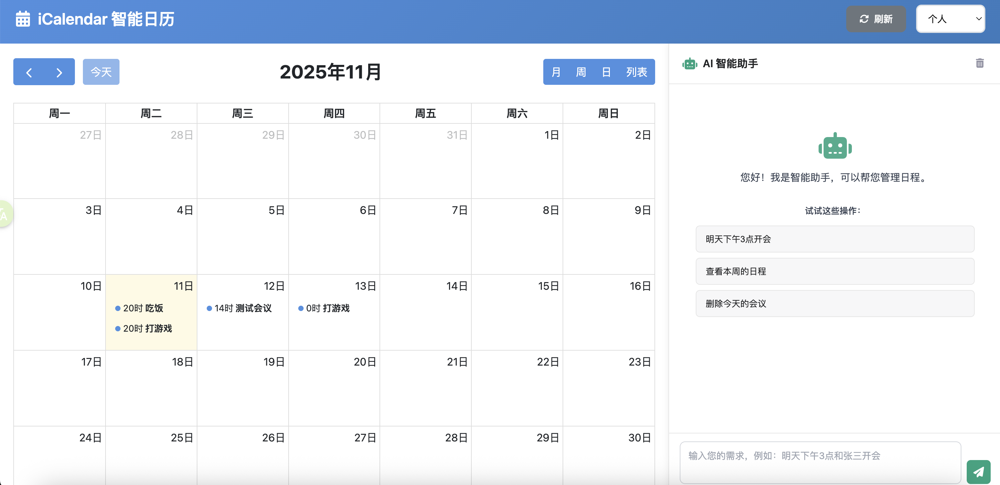

# 🗓️ iCalendar 智能日历系统

[](https://www.python.org/)
[](https://fastapi.tiangolo.com/)
[](LICENSE)

一个集成 DeepSeek AI 和 iCloud CalDAV 的现代化智能日历管理系统。通过自然语言轻松管理您的日程安排。



---

## ✨ 核心特性

### 🤖 AI 驱动的自然语言处理
- 使用 DeepSeek API 理解自然语言命令
- 支持中文口语化输入
- 智能时间解析（今天、明天、下周一等）
- 自动提取事件标题、时间、地点

**示例**：
```
"明天下午3点和张三开会"
"下周三上午9点到10点团队会议"
"删除和里斯的会议"
"把明天的会议改到后天"
```

### 📅 完整的日历功能
- ✅ 创建、查看、更新、删除事件
- ✅ 支持多个日历管理
- ✅ 拖拽调整事件时间
- ✅ 月/周/日/列表多种视图
- ✅ 实时同步到 iCloud

### 🌐 现代化 Web 界面
- 响应式设计，适配各种设备
- FullCalendar 可视化日历
- 直观的智能助手输入框
- 平滑动画和交互效果

### 🔌 双模式支持
1. **Web 模式**：通过浏览器访问
2. **MCP 模式**：供 Claude、ChatGPT 等 AI 助手调用

---

## 🚀 快速开始

### 前置要求

- **Python 3.12+**
- **uv** 包管理工具
- **iCloud 账号** 和应用专用密码
- **DeepSeek API** 密钥

### 1. 安装 uv

```bash
# macOS/Linux
curl -LsSf https://astral.sh/uv/install.sh | sh

# Windows
powershell -c "irm https://astral.sh/uv/install.ps1 | iex"
```

### 2. 克隆项目

```bash
git clone https://github.com/yourusername/iCalendar.git
cd iCalendar
```

### 3. 安装依赖

```bash
uv sync
```

### 4. 配置凭据

#### 4.1 创建配置文件

```bash
cp config.json.example config_private.json
```

#### 4.2 获取 iCloud 应用专用密码

1. 访问 [Apple ID 管理页面](https://appleid.apple.com/)
2. 登录您的 Apple ID
3. 进入 **登录与安全** → **应用专用密码**
4. 点击 **生成密码**
5. 为密码命名（如 "iCalendar"）
6. 复制生成的密码（格式：`xxxx-xxxx-xxxx-xxxx`）

#### 4.3 获取 DeepSeek API 密钥

1. 访问 [DeepSeek 平台](https://platform.deepseek.com/)
2. 注册并登录账户
3. 进入 **API Keys** 页面
4. 创建新的 API 密钥
5. 复制密钥（格式：`sk-xxxxxxxxxxxxxxxx`）

#### 4.4 编辑配置文件

```bash
# 使用您喜欢的编辑器
nano config_private.json
# 或
vi config_private.json
# 或
open -a TextEdit config_private.json
```

填入您的凭据：

```json
{
  "caldav": {
    "server_url": "https://caldav.icloud.com/",
    "username": "your_apple_id@icloud.com",
    "password": "xxxx-xxxx-xxxx-xxxx"
  },
  "deepseek": {
    "api_key": "sk-xxxxxxxxxxxxxxxxxxxxxx",
    "base_url": "https://api.deepseek.com"
  }
}
```

### 5. 启动服务器

#### 后台运行（推荐）

```bash
nohup uv run uvicorn web_client.app:app --host 0.0.0.0 --port 8000 > web_server.log 2>&1 &
```

#### 前台运行（开发调试）

```bash
uv run uvicorn web_client.app:app --host 0.0.0.0 --port 8000 --reload
```

### 6. 访问 Web 界面

在浏览器中打开：**http://localhost:8000**

🎉 **完成！** 现在您可以开始使用智能日历系统了！

---

## 📖 使用指南

### 自然语言命令示例

#### 创建事件
```
✅ "明天下午3点提醒我开会"
✅ "下周三上午9点到10点团队会议"
✅ "本周五晚上8点看电影"
✅ "11月15日下午2点产品发布会"
```

#### 查询事件
```
✅ "今天有什么安排？"
✅ "本周有什么事情？"
✅ "下个月有什么会议？"
```

#### 更新事件
```
✅ "把明天的会议改到后天"
✅ "将周五的会议时间改为下午2点"
✅ "把和张三的会议改到明天下午2点"
```

#### 删除事件
```
✅ "取消明天的会议"
✅ "删除今天下午的活动"
✅ "删除和里斯的会议"
```

### 智能匹配功能

系统支持按标题智能匹配事件：

- **单个匹配**：直接执行操作
  ```
  "删除和里斯的会议" → ✅ 直接删除
  ```

- **多个匹配**：返回列表供选择
  ```
  "删除和张三的活动" → 
  找到 2 个匹配的事件：
  1. 和张三的会议 (11月12日 14:00)
  2. 和张三喝咖啡 (11月13日 09:00)
  
  → 使用更精确的描述：
  "删除和张三喝咖啡的活动" → ✅ 精确删除
  ```

### Web 界面功能

#### 侧边栏
- **智能助手**：输入自然语言命令
- **快捷操作**：创建事件、回到今天、刷新
- **日历筛选**：按日历显示事件
- **系统状态**：在线/离线指示器

#### 主日历区域
- **视图切换**：月/周/日/列表
- **拖拽创建**：点击日期创建事件
- **拖拽调整**：拖动事件改变时间
- **点击查看**：点击事件查看详情

#### 快捷键（即将支持）
- `Ctrl/Cmd + N` - 创建新事件
- `Ctrl/Cmd + F` - 搜索事件
- `T` - 回到今天

---

## 🛠️ 服务管理

### 启动服务

```bash
# 后台运行
nohup uv run uvicorn web_client.app:app --host 0.0.0.0 --port 8000 > web_server.log 2>&1 &

# 前台运行（开发模式）
uv run uvicorn web_client.app:app --host 0.0.0.0 --port 8000 --reload
```

### 停止服务

```bash
# 方法 1：按进程名停止
pkill -f "uvicorn web_client.app"

# 方法 2：强制停止占用 8000 端口的进程
lsof -ti :8000 | xargs kill -9
```

### 检查服务状态

```bash
# 查看进程
lsof -i :8000

# 测试健康检查
curl http://localhost:8000/api/health

# 查看服务器日志
tail -f web_server.log
```

### 重启服务

```bash
pkill -f "uvicorn web_client.app" && sleep 2 && \
nohup uv run uvicorn web_client.app:app --host 0.0.0.0 --port 8000 > web_server.log 2>&1 &
```

---

## 🔌 API 文档

服务器启动后，访问以下地址查看完整 API 文档：

- **Swagger UI**: http://localhost:8000/docs
- **ReDoc**: http://localhost:8000/redoc

### 主要 API 端点

#### 健康检查
```http
GET /api/health
```

#### 日历管理
```http
GET /api/calendars
```

#### 事件 CRUD
```http
GET    /api/events?start_date=2025-11-01&end_date=2025-11-30
POST   /api/events
PUT    /api/events/{event_id}
DELETE /api/events/{event_id}
```

#### 自然语言处理
```http
POST /api/nl/execute
Content-Type: application/json

{
  "text": "明天下午3点和张三开会",
  "context": {}
}
```

---

## 📁 项目结构

```
iCalendar-main/
├── mcp_ical/              # 核心业务逻辑
│   ├── caldav_client.py   # CalDAV 客户端
│   ├── config.py          # 配置管理
│   ├── deepseek_client.py # DeepSeek AI 集成
│   ├── ical.py            # 日历管理器
│   ├── models.py          # 数据模型
│   └── server.py          # MCP 服务器
│
├── web_client/            # Web 应用
│   ├── app.py             # FastAPI 主应用
│   ├── templates/         # HTML 模板
│   │   └── index.html
│   └── static/            # 静态资源
│       ├── css/
│       │   └── style.css
│       └── js/
│           └── app.js
│
├── config_private.json    # 私有配置（不提交）
├── config.json.example    # 配置模板
├── pyproject.toml         # 项目配置
└── README.md              # 本文档
```

详细架构说明请查看 [PROJECT_ARCHITECTURE.md](PROJECT_ARCHITECTURE.md)

---

## 🧪 测试

### 运行测试

```bash
# 运行所有测试
uv run pytest

# 显示详细输出
uv run pytest -v

# 运行特定测试
uv run pytest test_calendar_manager_integration.py

# 显示覆盖率
uv run pytest --cov=mcp_ical --cov=web_client
```

### 功能测试清单

- [ ] 连接到 iCloud CalDAV
- [ ] 列出所有日历
- [ ] 创建新事件
- [ ] 更新现有事件
- [ ] 删除事件
- [ ] 查询指定时间范围的事件
- [ ] 自然语言创建事件
- [ ] 自然语言查询事件
- [ ] 自然语言更新事件
- [ ] 自然语言删除事件
- [ ] 按标题模糊匹配事件
- [ ] Web 界面加载和显示
- [ ] 拖拽创建事件
- [ ] 拖拽调整事件时间

---

## 🔧 故障排除

### 问题 1：无法连接到 iCloud

**错误信息**: "Authentication failed" 或 "Connection error"

**解决方案**:
1. ✅ 确认使用的是**应用专用密码**，不是 Apple ID 密码
2. ✅ 检查 Apple ID 和密码是否正确
3. ✅ 确认 iCloud 日历已启用
4. ✅ 检查网络连接
5. ✅ 尝试重新生成应用专用密码

### 问题 2：DeepSeek API 调用失败

**错误信息**: "API key invalid" 或 "Rate limit exceeded"

**解决方案**:
1. ✅ 确认 API 密钥正确无误
2. ✅ 检查 API 配额是否充足
3. ✅ 访问 [DeepSeek 控制台](https://platform.deepseek.com/) 查看状态
4. ✅ 确认网络可以访问 DeepSeek API

### 问题 3：端口被占用

**错误信息**: "[Errno 48] Address already in use"

**解决方案**:
```bash
# 查看占用 8000 端口的进程
lsof -i :8000

# 终止占用端口的进程
pkill -f "uvicorn web_client.app"
# 或强制终止
lsof -ti :8000 | xargs kill -9
```

### 问题 4：依赖安装失败

**解决方案**:
```bash
# 清理缓存并重新安装
rm -rf .venv
uv sync --force

# 或手动安装依赖
uv pip install fastapi uvicorn httpx loguru caldav vobject
```

### 问题 5：无法创建事件

**错误信息**: "Forbidden" 或 "Permission denied"

**原因**: 尝试在只读日历（如订阅日历）中创建事件

**解决方案**:
1. ✅ 在 Web 界面中选择可写的日历
2. ✅ 避免在"节假日"等订阅日历中创建事件
3. ✅ 访问 http://localhost:8000/api/calendars 查看所有日历

---

## 🔐 安全建议

### 配置文件安全
- ⚠️ **永远不要**将 `config_private.json` 提交到 Git
- ⚠️ 定期更换 API 密钥和应用专用密码
- ⚠️ 使用环境变量存储敏感信息（生产环境）

### 网络安全
- ✅ 生产环境使用 HTTPS
- ✅ 配置防火墙规则
- ✅ 使用反向代理（Nginx/Caddy）
- ✅ 限制 API 访问速率

### 数据安全
- ✅ 所有日历数据通过 HTTPS 传输
- ✅ 凭据存储在本地配置文件
- ✅ 不在日志中记录敏感信息

---

## 📊 性能优化

### 前端优化
- 事件按需加载
- 防抖处理用户输入
- 缓存日历列表
- 懒加载静态资源

### 后端优化
- 异步 I/O 处理
- 连接池复用
- 适当的日志级别
- 数据压缩传输

---

## 🚢 生产部署

### 使用 Systemd（推荐）

1. 创建服务文件 `/etc/systemd/system/icalendar.service`:

```ini
[Unit]
Description=iCalendar Web Service
After=network.target

[Service]
Type=simple
User=your_user
WorkingDirectory=/path/to/iCalendar
ExecStart=/path/to/.venv/bin/uvicorn web_client.app:app --host 0.0.0.0 --port 8000
Restart=always
RestartSec=10

[Install]
WantedBy=multi-user.target
```

2. 启动服务:

```bash
sudo systemctl daemon-reload
sudo systemctl enable icalendar
sudo systemctl start icalendar
```

### 使用 Nginx 反向代理

配置文件 `/etc/nginx/sites-available/icalendar`:

```nginx
server {
    listen 80;
    server_name your_domain.com;

    location / {
        proxy_pass http://localhost:8000;
        proxy_set_header Host $host;
        proxy_set_header X-Real-IP $remote_addr;
        proxy_set_header X-Forwarded-For $proxy_add_x_forwarded_for;
        proxy_set_header X-Forwarded-Proto $scheme;
    }
}
```

### Docker 部署（即将支持）

```bash
docker-compose up -d
```

---

## 🤝 贡献指南

欢迎贡献代码、报告问题或提出建议！

### 报告问题

请在 [GitHub Issues](https://github.com/yourusername/iCalendar/issues) 中报告问题，并提供：

- 问题描述
- 复现步骤
- 预期行为
- 实际行为
- 系统环境（操作系统、Python 版本等）
- 相关日志

### 提交代码

1. Fork 本仓库
2. 创建特性分支 (`git checkout -b feature/AmazingFeature`)
3. 提交更改 (`git commit -m 'Add some AmazingFeature'`)
4. 推送到分支 (`git push origin feature/AmazingFeature`)
5. 创建 Pull Request

### 开发规范

- 遵循 PEP 8 代码风格
- 添加必要的注释和文档字符串
- 编写单元测试
- 更新相关文档

---

## 📄 许可证

本项目采用 MIT 许可证。详见 [LICENSE](LICENSE) 文件。

---

## 🙏 致谢

### 技术栈
- [FastAPI](https://fastapi.tiangolo.com/) - 现代 Web 框架
- [FullCalendar](https://fullcalendar.io/) - 日历组件
- [DeepSeek](https://www.deepseek.com/) - AI 自然语言处理
- [python-caldav](https://github.com/python-caldav/caldav) - CalDAV 客户端

### 灵感来源
- Apple Calendar
- Google Calendar
- Notion Calendar

---

## 📞 联系方式

- **项目主页**: https://github.com/yourusername/iCalendar
- **问题反馈**: https://github.com/yourusername/iCalendar/issues
- **邮箱**: your.email@example.com

---

## 🗺️ 路线图

### v1.0 ✅
- [x] CalDAV 集成
- [x] DeepSeek AI 集成
- [x] Web 界面
- [x] 自然语言处理
- [x] 智能事件匹配

### v1.1（规划中）
- [ ] 循环事件支持
- [ ] 事件提醒功能
- [ ] 日历导入/导出
- [ ] 移动端优化
- [ ] 多语言支持

### v2.0（未来）
- [ ] 离线模式
- [ ] 团队协作功能
- [ ] 更多 AI 功能（智能建议、冲突检测）
- [ ] 第三方日历集成（Google Calendar、Outlook）
- [ ] Docker 支持
- [ ] 移动应用

---

<div align="center">

**⭐ 如果觉得这个项目有帮助，请给个 Star！⭐**

Made with ❤️ by iCalendar Team

</div>
